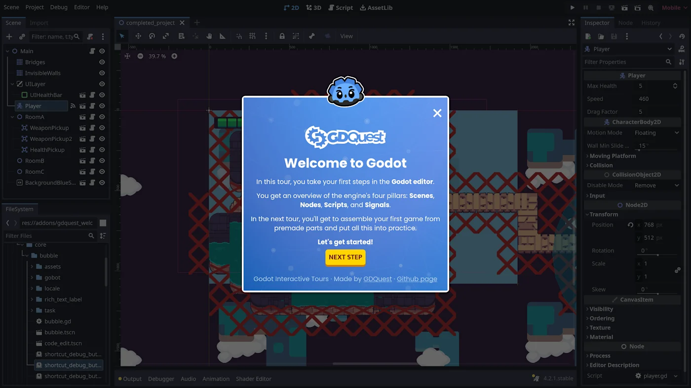

# Tradução do Godot Tours

Esse projeto é um fork do Godot Tours com intuito de traduzir o projeto para o Português-Brasileiro(PT-BR).

# Godot Tours

Godot Tours é um framework para criar tutoriais interativos e passo-a-passo no editor do Godot.



Essa é uma tecnologia que usamos no GDQuest para criar tour guiados. Essa tecnologia é gratuita e open-source então você é bem-vindo a estuda-la e usa-la.

**Versão minima do Godot requerida: Godot 4.2 padrão** (*não* a edição .NET)

**Aviso: Godot Tours é um projeto experimental.** Apesar de parecer funcionar de maneira confiável no Godot 4.2 estável, nós ainda estamos refinando a API em quanto produzimos nossos tours interativos. Porfavor, note que talvez possamos fazer mudanças que quebrem a API do Tour em novas versão para que possamos melhora-la. 

## Suporte e Contribuições

Devido aos nosso recursos limitados e a quantidade de trabalho que esse projeto representa, está atualmente 
Given our limited resources, and the amount of work that this project represents, atualmente é fornecido como está: nós não oferecemos suporte inidividual ou de comunidade para esse projeto.

Se você deseja contribuir, porfavor nos contato primeiro para assegurar que sua contribuição alinha com os objetivos do projeto, e porfavor note que nossa disponibilidade para revisar contribuições são limitadas.

Se é algo que nós precisamos ou planejamos trabalhar, nós provavelmente seremos capazes de revisar razoamente rápido. Caso contrário, nós não prometemos que iremos ter tempo para revisar ou que iremos mesclar seu trabalho.

## Creating tours

A tour is a GDScript file that extends `res://addons/godot_tours/tour.gd`.

To learn how to use the framework and create a tour, we invite you to check out the open-source tour [101 - The Godot Editor](https://github.com/gdquest-demos/godot-tours-101-the-godot-editor). You can use it as a reference to build your own tours.

Also, we invite you to open the file `res://addons/godot_tours/tour.gd` to learn more about how the system works and see all of the functions provided to build tours.

## Registering tours

To register a tour in the menu that appears upon opening the Godot project, you need to create a resource file named `godot_tours.tres` at the root of the Godot project. It should extend the file `res://addons/godot_tours/godot_tour_list.gd`.

## Translating tours

Godot Tours supports translations in the Portable Object (PO) format. To learn how to translate tours, please refer to the [documentation on translating Godot tours](documentation/translating_godot_tours.md).

## Features overview

Godot Tours comes with these features, in the `core` folder of the addon:

- The default UI Bubble which provides step-by-step instructions and explanations. It contains:
  - An optional header.
  - Any number of text descriptions, media (images, videos), code listings, and (verifiable) tasks added to the body.
  - An optional footer.
  - The Godot Bot animated avatar.
- The ability to add your own custom bubble and replace the default one.
- A debug dock which helps instructors prepare and navigate the tours, toggled with <kbd>CTRL</kbd><kbd>F10</kbd>.
- A Mouse Preview for previewing actions such as: Drag n' Drop, Click, Press, Release.
- An Overlays manager that prevents students from interacting with the *Editor Interface* UI elements. The instructor can give access to the underlying UI elements using highlights that disable the overlays on mouse-over.
- A Translation system provides two functions:
  1. A Parser that extracts strings used in `gtr()`, `gtr_n()` and `ptr()` function calls.
  2. A `*.[mo,po]` files loader and mapper depending on the *Editor* language setting.
- A Tour builder API that constructs the actual guided steps using the systems listed so far.

## Using Godot Tours in Other Projects

Godot Tours works like any other Godot addon. You can clone or download the repository files and copy and paste the addons folder to your project.

The easiest way to keep this addon up to date is to use the addon manager [gd-plug](https://github.com/imjp94/gd-plug):

1. Install **gd-plug** using the Godot Asset Library.
2. Save the following code into the file `res://plug.gd` (create the file if necessary):

  ```gdscript
  #!/usr/bin/env -S godot --headless --script
  extends "res://addons/gd-plug/plug.gd"


  func _plugging() -> void:
  	plug(
  		"git@github.com:GDQuest/godot-tours.git",
  		{include = ["addons/godot_tours"]}
  	)
  ```

3. On Linux, make the `res://plug.gd` script executable with `chmod +x plug.gd`.
4. Using the command line, run `./plug.gd install` or `godot --headless --script plug.gd install`.
